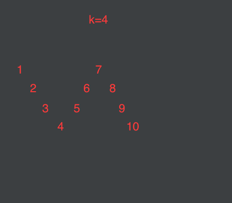

# ZigZag Conversion

From leetcode 6

**Question:**

The string "PAYPALISHIRING" is written in a zigzag pattern on a given number of rows like this: (you may want to display this pattern in a fixed font for better legibility)
```
P   A   H   N
A P L S I I G
Y   I   R

```
And then read line by line: "PAHNAPLSIIGYIR"

Write the code that will take a string and make this conversion given a number of rows:

string convert(string text, int nRows);
convert("PAYPALISHIRING", 3) should return "PAHNAPLSIIGYIR".


**Solution:**

```
public class Solution {

    public String convert(String s, int numRows) {
        if (numRows == 1) {
            return s;
        }
        StringBuilder sb = new StringBuilder();
        int magic = numRows * 2 - 2;
        int initialDistance = magic;
        for (int i = 0; i < numRows; i++) {
            fill(sb, i, initialDistance, magic, s);
            initialDistance = initialDistance - 2; //对应思路讲解第5条
        }
        return sb.toString();
    }


    public void fill(StringBuilder sb, int start, int initialDistance, int magic, String s) {
        while (start < s.length()) {
            if (initialDistance == 0) {   //对应思路讲解第6条
                initialDistance = magic;
            }
            sb.append(s.charAt(start));
            start = start + initialDistance;
            initialDistance = magic - initialDistance;//对应思路讲解第4条

        }
    }
}

```


**Explanation:**

转载: https://segmentfault.com/a/1190000005751185



经观察发现，对于每个nRows(为了简便用k表示),都有一个自己的magic number = 2 * k - 2,magic number的用处请往下看:
下面我们研究一下怎么打印这个波浪，你们感受一下：

1. 经观察，一共要打k行，每行打的规则是相同的，于是打每行的函数单独提出来：fill();
2. 研究一下fill这个函数怎么写，经观察，发现打印一行需要三个参数，startIndex, distance1, distance2，且distance1 + distance2 = magic number；但是，第一行和最后一行是两个特例，他们的distance1 = distance2 = magic number，单独考虑一下就行了;
3. 来细化一下fill()这个接口：
```
void fill(StringBuilder sb,    //存结果，必须有
          int start,           //这行从哪开始打？第几行就从几打，即k
          int initialDistance, //下个字符去哪找？加上distance就是下个字符
          int magic,           //magic number
          String s)            //原字符串，必须有
```          
4. 注意上面这个initialDistance参数，每行两个字符的distance不是固定的，他的规则是(magic=8,initialDistance=2):2,6,2,6,2,6....想得到下一个distance用magic减去当前distance就好啦;
5. 下面研究一下对于每一行最开始应该传进去的initialDistance是多少。经观察，打第0行的时候，initialDistance是magic number，第1行的initialDistance是magic number - 2, 第2行的是magic number - 4...总之打完一行把initialDistance减去2就行了;
6. 注意了，第0行和最后一行的distance是固定的，都是magic number，要写一句if;


